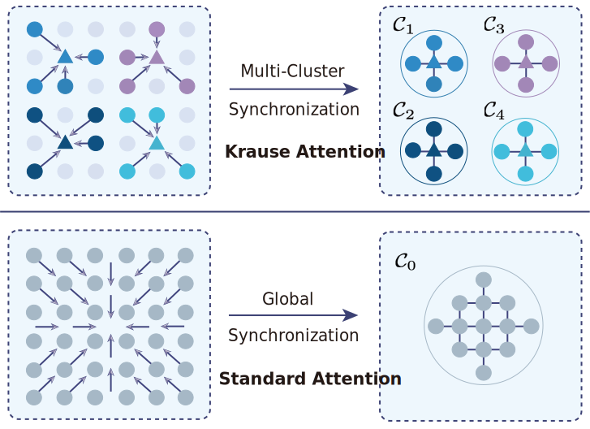
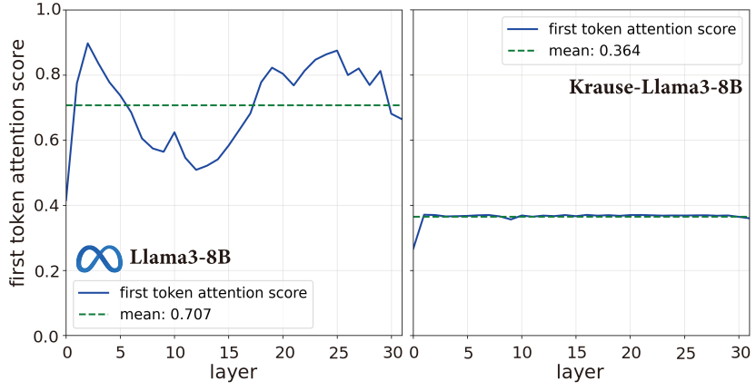
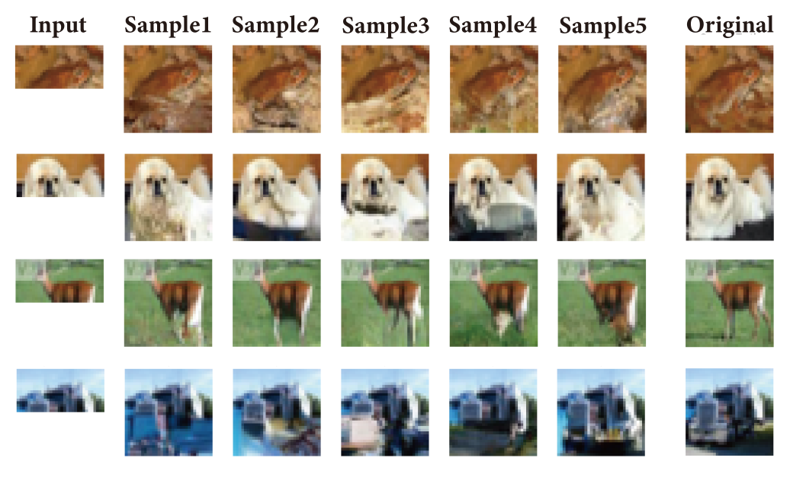

# Krause Synchronization Transformers
This repository contains the implementation for the paper Krause Synchronization Transformers. In our work, we introduce <strong>Krause Attention</strong>, a principled attention mechanism inspired by bounded-confidence consensus dynamics. Krause Attention replaces similarity-based global aggregation with distance-based, localized, and selectively sparse interactions, promoting structured local synchronization instead of global mixing. We relate this behavior to recent theory modeling Transformer dynamics as interacting particle systems, and show how bounded-confidence interactions naturally moderate attention concentration and alleviate attention sinks. Restricting interactions to local neighborhoods also reduces runtime complexity from quadratic to linear in sequence length. Experiments across vision (ViT on CIFAR/ImageNet), autoregressive generation (MNIST/CIFAR-10), and large language models (Llama/Qwen) demonstrate consistent gains with substantially reduced computation, highlighting bounded-confidence dynamics as a scalable and effective inductive bias for attention.

<section class="hero teaser">
  

    

      

         
             

    

  

</section>

<section class="hero is-small">
  

    

      

        <h2 class="title is-2.5 has-text-left">Krause Attention</h2>
        

          
        </h2>
      

    

  

</section>

<section class="hero is-small">
  

    

      

        <h2 class="title is-2.5 has-text-left">Alleviating Attention Sinks in Krause-LLMs</h2>
        

          
        

        </h2>
      

    

  

</section>

<section class="hero is-small" style="background: transparent;">
  

    

      
        
        <h2 class="title is-2.5 has-text-left">Attention Heatmaps in Vision Transformers</h2>        
        

          
        

        

          
        

      

    

  

</section>

<section class="hero is-small" style="background-color: #f5f5f5 !important; padding: 40px 0;">
  

    

      

        <h2 class="title is-2.5 has-text-centered">Krause Autoregressive Transformers for Image Generation</h2>        
        

          

            

              
            

          

          

            

              
            

          

        

      

    

  

</section>

